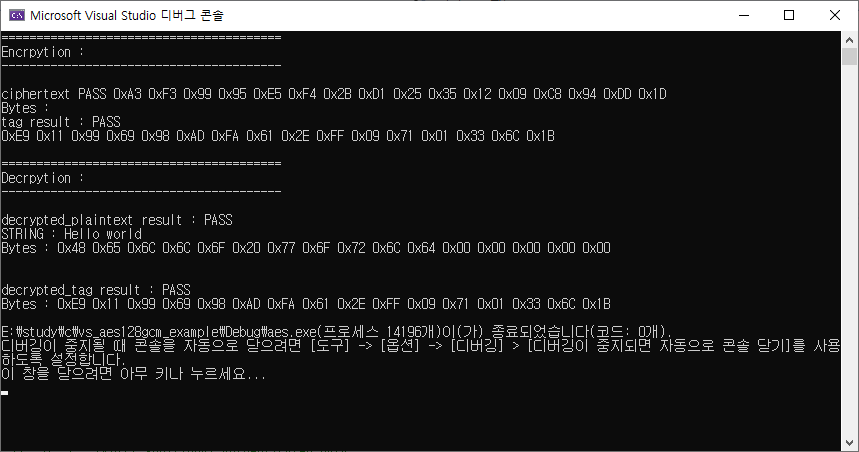

# aes-128-gcm-c-example
# AES-128-GCM C 코드 예제

## 참고  
 AES128GCM 코드 https://github.com/yuryshukhrov/aes128-gcm-block-cipher
 
 복호화 함수 aes128gcm_dec와 인자 명 일부 수정.

## 테스트 환경 

    OS : Windows 10
    Compiler : Visual Studio 2019

## 암호화 함수 

    void aes128gcm_enc(unsigned char* ciphertext, unsigned char* tag, const unsigned char* k, const unsigned char* IV, const unsigned char* plaintext, const unsigned long block_len, const unsigned char* add_data, const unsigned long add_len)

      ciphertext : 리턴되는 암호화 데이터
      tag : 리턴되는 TAG 데이터 GMAC
      k : 암호키 16바이트 단위
      IV : 초기화 키(1회용 키, Nonce) 
      plaintext : 암화화 시킬 평문 데이터
      block_len : 암호화 블럭 길이
       -. 최소 1 이상 1 = 16바이트
      add_data : 추가 인증 데이터
      add_len : 추가 인증 길이 (블럭 단위)
       -. 1 블럭 = 16바이트

## 복호화 함수
    void aes128gcm_dec(unsigned char* plaintext, unsigned char* tag, const unsigned char* k, const unsigned char* IV, const unsigned char* ciphertext, const unsigned long block_len, const unsigned char* add_data, const unsigned long add_len)
    
      plaintext : 리턴되는 복호화된 데이터
      tag : 리턴되는 TAG 데이터 GMAC
      k : 암호키 16바이트 단위
      IV : 초기화 키(1회용 키, Nonce) 
      ciphertext : 복호화 시킬 암호 데이터
      block_len : 복호화 블럭 길이
       -. 최소 1 이상 1 = 16바이트
      add_data : 추가 인증 데이터
      add_len : 추가 인증 길이 (블럭 단위)
       -. 1 블럭 = 16바이트

실행 결과

